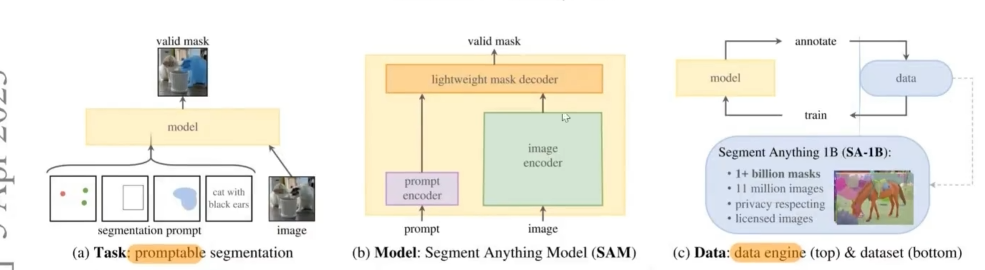

# SAM（Segment Anything Model）架构理解笔记

## 参考资料

CSDN参考文章：  
https://blog.csdn.net/m0_73904484/article/details/155454014

附图：

- SAM整体结构图

  <!--  -->
<!--  -->

---

# 1. SAM整体架构

SAM整体结构：

```text
Image
  ↓
Image Encoder
  ↓
Prompt Encoder
  ↓
Lightweight Mask Decoder
  ↓
Mask
```

论文中的核心思想：

## Promptable Segmentation

即：

给定一个prompt  
输出对应的mask

类似于：

LLM：

```text
text prompt → text
```

SAM：

```text
visual prompt → segmentation mask
```

---

# 2. Image Encoder

SAM使用：

## Vision Transformer（ViT）

主要模型：

| 模型  | 规模  |
| ----- | ----- |
| ViT-B | Base  |
| ViT-L | Large |
| ViT-H | Huge  |

---

## Image Encoder作用

本质：

```text
image
→ dense image embedding
```

例如：

```text
1024×1024 image
↓
64×64×256 feature map
```

---

## ViT内部过程

### Step1：Patchify

例如：

```text
1024×1024 image
```

切成：

```text
16×16 patch
```

得到：

```text
64×64 patches
```

共：

```text
4096 patch tokens
```

---

### Step2：Patch Embedding

每个patch：

```text
16×16×3
```

flatten后：

```text
linear projection
→ embedding vector
```

---

### Step3：Transformer Encoder

通过：

- Self Attention
- MLP
- LayerNorm

不断编码。

最后得到：

```text
dense image embedding
```

---

# 3. 为什么SAM使用ViT

因为：

Segmentation需要全局关系。

CNN：

```text
局部卷积
```

ViT：

```text
全局attention
```

因此：

更容易理解：

```text
哪些区域属于同一个物体
```

---

# 4. Prompt Encoder

SAM支持：

| Prompt类型       | 示例     |
| ---------------- | -------- |
| Point            | 一个点   |
| Box              | 一个框   |
| Mask             | 已有mask |
| Text（扩展版本） | 类别文字 |

---

# 5. Prompt Encoder核心思想

不同prompt：

- point
- bbox
- mask

本质格式不同。

SAM核心思想：

## 全部转成embedding

即：

```text
各种prompt
→ embedding space
```

---

# 6. Point Prompt编码

例如：

```text
point = (x,y)
label = 1
```

---

## Step1：位置编码

先将：

```text
(x,y)
```

变成：

```text
positional embedding
```

类似Transformer中的：

```text
sin/cos encoding
```

---

## Step2：加入点类型embedding

SAM区分：

| label | 含义   |
| ----- | ------ |
| 1     | 前景点 |
| 0     | 背景点 |

因此：

- foreground embedding
- background embedding

会加入。

最终：

```text
point token
```

形成。

---

# 7. Box Prompt编码

box：

```text
[x1,y1,x2,y2]
```

SAM本质上：

## 将box看成两个corner points

即：

- 左上角token
- 右下角token

---

# 8. Mask Prompt编码

mask本身：

是二维空间结构。

因此：

不能简单变成单个token。

SAM会：

```text
mask
→ CNN downsample
→ dense embedding
```

最终形成：

```text
dense prompt embedding
```

---

# 9. Prompt Encoder输出

输出两类：

---

## Sparse Embeddings

用于：

- point
- bbox

因为：

```text
token数量少
```

---

## Dense Embeddings

用于：

```text
mask prompt
```

因为：

```text
mask是spatial map
```

---

# 10. Lightweight Mask Decoder

SAM最核心部分之一。

结构：

```text
image embedding
+
prompt embedding
+
output tokens
↓
lightweight transformer decoder
↓
mask
+
IoU score
```

---

# 11. Decoder中的Output Tokens

这里非常关键。

SAM decoder输入不仅有prompt token。

还包含：

## learnable output tokens

包括：

- IoU token
- multiple mask tokens

例如：

```text
[IoU token]
[mask token1]
[mask token2]
[mask token3]
```

---

# 12. Output Tokens是什么

这些：

不是输入数据。

而是：

## 模型内部learnable parameters

例如：

```python
self.mask_tokens = nn.Parameter(...)
self.iou_token = nn.Parameter(...)
```

训练开始时：

```text
随机初始化
```

训练过程中：

```text
不断通过梯度下降优化
```

---

# 13. Learnable Tokens在Transformer中常见吗

## BERT中的CLS Token

例如：

```text
[CLS] hello world
```

CLS token：

是learnable token。

用于：

```text
聚合整个句子的语义
```

---

## ViT中的CLS Token

Vision Transformer：

```text
[CLS]
+
patch tokens
```

最后：

```text
CLS token
```

聚合：

```text
整个图像的信息
```

用于分类。

---

## DETR中的Object Queries

DETR：

```text
100 learnable object queries
```

这些query：

通过cross attention

查询图像feature。

最终：

学会检测目标。

---

# 14. SAM与DETR的对应关系

| DETR             | SAM               |
| ---------------- | ----------------- |
| object query     | mask token        |
| class prediction | IoU prediction    |
| bbox output      | segmentation mask |

---

# 15. Attention中的Q/K/V

token本身不是Q。

而是：

```text
token embedding
→ linear projection
→ Q/K/V
```

即：

```text
Q = XW_Q
K = XW_K
V = XW_V
```

其中：

```text
X = token embeddings
```

---

# 16. Decoder中的Attention

Decoder中：

- mask tokens
- IoU token
- prompt tokens

会和：

```text
image embeddings
```

不断attention交互。

---

# 17. Mask Token是什么

注意：

mask token不是mask本身。

它只是：

```text
用于生成mask的query embedding
```

最终：

```text
mask token
×
image feature
```

动态生成：

```text
HxW mask
```

---

# 18. 为什么有多个Mask Tokens

因为：

一个prompt可能有歧义。

例如：

一个点在衣服上：

| Mask  | 含义     |
| ----- | -------- |
| mask1 | 整个人   |
| mask2 | 衣服     |
| mask3 | 局部区域 |

因此：

SAM会输出多个candidate masks。

用于：

```text
ambiguity resolution
```

---

# 19. IoU Token

Decoder中：

IoU token

不是：

```text
一个随机分数
```

而是：

```text
一个learnable embedding vector
```

例如：

```python
iou_token = nn.Parameter(torch.randn(256))
```

---

# 20. IoU Token作用

作用：

## 预测mask质量

即：

```text
这个mask和GT mask的IoU大概是多少
```

---

# 21. IoU监督如何获得

训练时：

有：

```text
GT mask
```

因此：

```text
pred mask
vs
GT mask
```

可以直接计算：

## IoU

公式：

:contentReference[oaicite:0]{index=0}

例如：

```text
预测mask面积 = 100
与GT重叠 = 80
union = 120
```

则：

:contentReference[oaicite:1]{index=1}

---

# 22. IoU Token如何训练

IoU token：

```text
经过decoder更新
↓
MLP
↓
输出 predicted IoU
```

例如：

```text
predicted IoU = 0.73
```

真实：

```text
actual IoU = 0.81
```

则：

:contentReference[oaicite:2]{index=2}

反向传播。

---

# 23. IoU Token本质

IoU token本质：

## quality query token

它会：

- 与image features
- 与prompt tokens
- 与mask tokens

不断attention交互。

最终：

学会：

```text
当前mask质量如何
```

---

# 24. 为什么SAM通常不需要NMS

因为：

SAM输出多个mask：

不是重复检测。

而是：

```text
对同一个prompt的不同解释
```

例如：

```text
一个点
→ 多种可能mask
```

因此：

SAM更像：

```text
candidate ranking
```

而不是：

```text
detection NMS
```

---

# 25. SAM Decoder本质

SAM Decoder本质非常像：

## Query-based Transformer Decoder

核心思想：

```text
learnable queries
去查询 image features
```

其中：

| Query类型             | 学到的功能         |
| --------------------- | ------------------ |
| mask token            | segmentation       |
| IoU token             | quality estimation |
| CLS token（其他模型） | classification     |
| object query（DETR）  | object detection   |

---

# 26. 一个非常关键的理解

Transformer中的token：

本身没有固定语义。

它只是：

```text
latent vector
```

token最终“学成什么”：

取决于：

```text
loss supervision
```

例如：

如果：

某个token负责分类。

它就会学成：

```text
classification token
```

如果：

某个token负责mask。

它就会学成：

```text
mask token
```

如果：

某个token负责预测IoU。

它就会学成：

```text
IoU token
```

---

# 27. SAM的核心思想总结

SAM核心：

## promptable segmentation

重点不在：

```text
识别类别
```

而在：

```text
学习“什么区域可以构成一个完整物体”
```

即：

## segmentability

因此：

```text
SAM泛化能力非常强
```